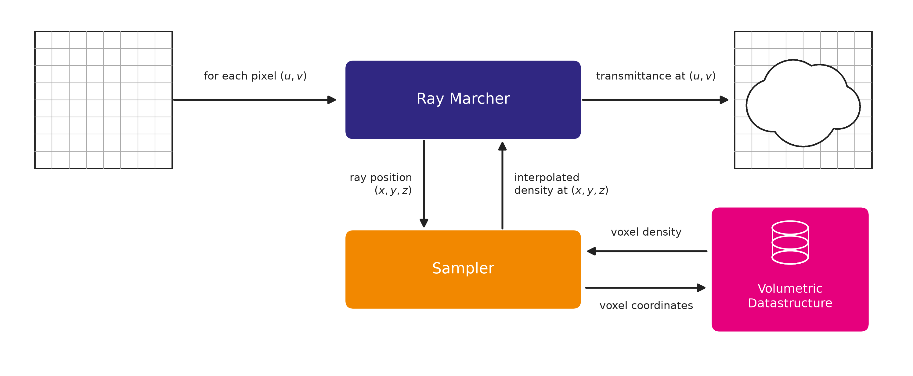

# Volumetric Data Structures for Ray Marching Clouds on the GPU

This repository contains the code and resources for the bachelor's thesis *"Volumetric Data Structures for Ray Marching Clouds on the GPU: Implementation and Comparative Analysis of a Dense Grid, a Two-Level Sparse Grid, and NanoVDB."*

## Repository Structure

```
rdv/src/grid_sandbox/
├── shaders/    GLSL compute shaders for all four volumetric representations
└── scripts/    Python scripts for measurements and RDV map classes
```

## Architecture



## Scripts

- `measurements/compare_sizes.py`: compares memory footprint for all three representations and calculates active voxels
- `measurements/measure.py`: CLI script for performance measurements
- `other/nvdb_converter.py`: linux script for converting `.nvdb` files to `.pt`
- `check_transmittance.py`: CLI script for rendering a cloud to an actual image output
- `utility.py`: utility functions and build functions for the two-level grid (and its padded variant)
- `grid_implementations.py`: map classes from rdv (mostly boilerplate)

## Shaders

**Samplers**

- `external/nanovdb/PNanoVDB.h`: header file for PNanoVDB
- `null_sampler.h`: null sampler without any fetches, used as a timing baseline
- `dense_grid3d.h`: sampler for the dense grid
- `two_level_grid3d.h`: sampler for the two-level grid
- `two_level_grid3d_padded.h`: sampler for the padded two-level grid
- `nanovdb_grid3d.h`: sampler for NanoVDB
- `nanovdb_grid3d_onefetch.h`: NanoVDB sampler with only one fetch, but full trilinear interpolation
- `nanovdb_grid3d_onefetch_notrilinear.h`: NanoVDB sampler with only one fetch and no interpolation

**Ray marchers**

- `transmittance_rm_two_level_dda.h`: sampler and ray loop for the two-level grid (3D-DDA)
- `transmittance_rm_two_level_dda_padded.h`: sampler and ray loop for the padded two-level grid (3D-DDA)
- `transmittance_rm_nanovdb_dda.h`: sampler and ray loop for NanoVDB (HDDA)

## Data

The `data/` folder is not included in this repository due to file size. The original `.pt` and `.nvdb` cloud volumes used for all measurements in the thesis are available here:

[**Download cloud files (LRZ Sync+Share)**](https://syncandshare.lrz.de/getlink/fiWEeHFbALiBSC1x4B89sP/)

## Acknowledgements

This thesis builds on *Rendervous (rdv)* and *vulky*, both created by [Ludwic Leonard](https://github.com/lleonart1984).